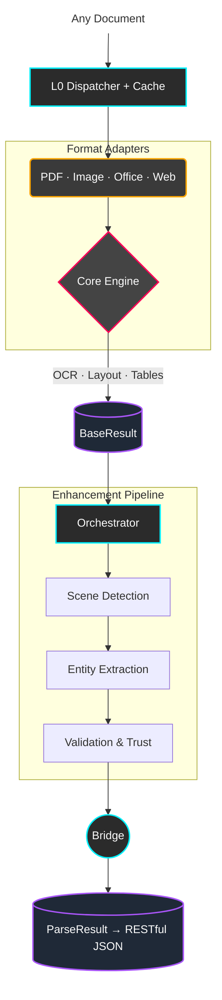

<p align="center">
  
</p>

<h1 align="center">📄 DocMirror</h1>

<p align="center">
  <strong>Transforms complex documents into LLM-ready structured data with industrial-grade precision.</strong><br/>
  PDF · Image · Word · Excel · PPT · HTML · Email — one API, structured JSON output.
</p>

<p align="center">
  <a href="https://pypi.org/project/docmirror/"></a>
  <a href="https://pypi.org/project/docmirror/"></a>
  <a href="LICENSE"></a>
  <a href="https://github.com/valuemapglobal/docmirror/actions"></a>
</p>

<p align="center">
  <b>English</b> | <a href="README_zh-CN.md">简体中文</a>
</p>

<p align="center">
  <a href="#-quick-start">Quick Start</a> •
  <a href="#-key-features">Key Features</a> •
  <a href="#-architecture">Architecture</a> •
  <a href="#-api-output">API Output</a> •
  <a href="#-supported-formats">Formats</a> •
  <a href="https://valuemapglobal.github.io/docmirror/">Documentation</a>
</p>

---

## Project Introduction

DocMirror is a universal document parsing engine that converts complex documents (PDFs, images, scanned files, Office documents) into clean, structured JSON with a standardized RESTful API. Built for **RAG pipelines**, **Agentic AI workflows**, and **enterprise data extraction**.

Unlike simple text extraction tools, DocMirror combines **computer vision**, **topological layout analysis**, and **middleware intelligence** to deliver:
- 🎯 **Structured tables** with typed cells (currency, date, text, number)
- 🔍 **Domain-aware entity extraction** (bank accounts, invoice numbers, etc.)
- 🛡️ **Document trust scoring** with forgery detection
- ⚡ **50ms parsing speed** for digital PDFs

## 🚀 Quick Start

### Install

```bash
# Core engine
pip install docmirror

# Full stack (PDF + OCR + Layout + Table + Office)
pip install "docmirror[all]"
```

### Python API

```python
import asyncio
from docmirror import perceive_document

async def main():
    result = await perceive_document("bank_statement.pdf")
    api = result.to_api_dict(include_text=True)

    # Standard RESTful output
    print(api["code"])      # 200
    print(api["message"])   # "success"

    # Access structured tables
    for page in api["data"]["document"]["pages"]:
        for table in page.get("tables", []):
            for row in table["rows"]:
                record = {
                    table["headers"][i]: cell["text"]
                    for i, cell in enumerate(row["cells"])
                }
                print(record)

asyncio.run(main())
```

### CLI

```bash
# Parse and output JSON
docmirror document.pdf --format json

# Parse with full markdown text
docmirror document.pdf --format json --include-text

# Batch parse a directory
docmirror ./documents/ --format json --output-dir ./results/
```

### REST API Server

```bash
# Start the server
pip install "docmirror[server]"
uvicorn docmirror.server.api:app --host 0.0.0.0 --port 8000

# Parse a document
curl -X POST http://localhost:8000/v1/parse \
  -F "file=@document.pdf" \
  -F "include_text=true"
```

## ✨ Key Features

- **Multi-Format Support** — PDF, PNG, JPG, DOCX, XLSX, PPTX, HTML, EML out of the box
- **Structured Table Extraction** — Headers, typed cells (currency/date/number/text), row classification
- **Smart OCR Fallback** — Auto-detects scanned documents, applies RapidOCR with dynamic contrast boosting
- **Layout Analysis** — DocLayout-YOLO + spatial clustering for complex multi-column layouts
- **Domain Plugins** — `BankStatement`, `Invoice` plugins auto-extract domain-specific entities
- **Anti-Forgery Detection** — Pixel Error Level Analysis (ELA) + metadata blacklisting
- **RESTful API** — Standard `{code, message, data, meta}` envelope with typed cells
- **Redis Caching** — Automatic content-hash caching for repeated documents
- **Pure CPU Support** — No GPU required; GPU/MPS acceleration available when present
- **Cross-Platform** — macOS, Linux, Windows with Python 3.10–3.13

## 📐 Architecture



## 📦 API Output

DocMirror produces a standardized RESTful JSON envelope:

```json
{
  "code": 200,
  "message": "success",
  "api_version": "1.0",
  "request_id": "req_abc123",
  "timestamp": "2026-03-18T10:22:17+00:00",
  "data": {
    "document": {
      "type": "bank_statement",
      "properties": {
        "organization": "Demo Bank",
        "subject_name": "Acme Corporation Ltd.",
        "subject_id": "6225********7890"
      },
      "pages": [
        {
          "page_number": 1,
          "tables": [{"headers": ["Date", "Description", "Amount"], "rows": ["..."]}],
          "texts": [{"content": "Account Statement", "level": "h1"}],
          "key_values": [{"key": "Account Holder", "value": "Acme Corporation Ltd."}]
        }
      ]
    },
    "quality": {
      "confidence": 1.0,
      "trust_score": 1.0,
      "validation_passed": true
    }
  },
  "meta": {
    "parser": "DocMirror",
    "version": "0.4.0",
    "elapsed_ms": 50.4,
    "page_count": 4,
    "table_count": 1,
    "row_count": 34
  }
}
```

**Cell types are minimal** — only `text` + `data_type` (when non-default):
```json
{"text": "2,970.00", "data_type": "currency"}
{"text": "2025-03-27", "data_type": "date"}
{"text": "Demo Bank"}
```

## 📋 Supported Formats

| Format | Adapter | Engine |
|---|---|---|
| PDF (digital) | `PDFAdapter` | PyMuPDF native tables |
| PDF (scanned) | `PDFAdapter` | RapidOCR + Layout YOLO |
| PNG / JPG / TIFF | `ImageAdapter` | RapidOCR + Layout analysis |
| DOCX | `WordAdapter` | python-docx |
| XLSX | `ExcelAdapter` | openpyxl |
| PPTX | `PPTAdapter` | python-pptx |
| HTML | `WebAdapter` | BeautifulSoup |
| EML | `EmailAdapter` | email.parser |
| CSV / JSON | `StructuredAdapter` | Native |

## 🗺️ Roadmap

- [x] RESTful API v1.0 envelope with typed cells
- [x] Anti-forgery pixel ELA detection
- [x] Redis caching layer
- [x] CLI with `--include-text` flag
- [ ] VLM (Vision-Language Model) integration for complex layouts
- [ ] Streaming parse for large documents
- [ ] WebSocket real-time parse progress
- [ ] Multi-language OCR (109 languages via PaddleOCR)
- [ ] Docker-based deployment with GPU support
- [ ] Benchmark suite against MinerU / Docling / Marker

## ❓ Known Issues

- Reading order may be suboptimal for extremely complex multi-column layouts
- OCR accuracy depends on scan quality; faded/low-DPI documents may need preprocessing
- Table recognition may produce row/column errors in tables with heavily merged cells
- Vertical Chinese text is not yet fully supported

## 🤝 Community & Support

- **Documentation**: [Complete API & Guide](https://valuemapglobal.github.io/docmirror/)
- **Bug Tracker**: [GitHub Issues](https://github.com/valuemapglobal/docmirror/issues)
- **Contribute**: PRs welcome! Run `pytest tests/` (131 tests) before submitting.

## 🙏 Acknowledgments

- [PyMuPDF](https://github.com/pymupdf/PyMuPDF) — PDF rendering and native table extraction
- [RapidOCR](https://github.com/RapidAI/RapidOCR) — High-performance OCR engine
- [DocLayout-YOLO](https://github.com/opendatalab/DocLayout-YOLO) — Document layout detection
- [RapidTable](https://github.com/RapidAI/RapidTable) — Table structure recognition
- [fast-langdetect](https://github.com/LlmKira/fast-langdetect) — Language detection
- [Pydantic](https://github.com/pydantic/pydantic) — Data validation and serialization
- [FastAPI](https://github.com/tiangolo/fastapi) — REST API framework

## 📄 License

Created by **Adam Lin** and maintained by **[ValueMap Global](https://valuemapglobal.com)**.  
Released under the [Apache 2.0 License](LICENSE).
