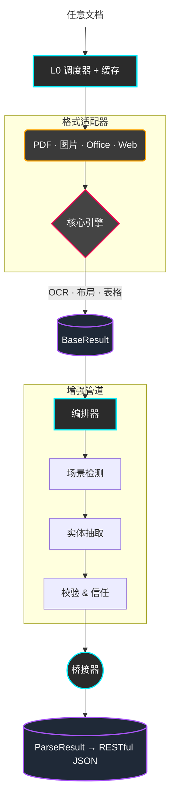

<p align="center">
  
</p>

<h1 align="center">📄 DocMirror</h1>

<p align="center">
  <strong>将复杂文档转化为 LLM 可用的结构化数据，具备工业级精度。</strong><br/>
  PDF · 图片 · Word · Excel · PPT · HTML · 邮件 — 一个 API，结构化 JSON 输出。
</p>

<p align="center">
  <a href="https://pypi.org/project/docmirror/"></a>
  <a href="https://pypi.org/project/docmirror/"></a>
  <a href="LICENSE"></a>
  <a href="https://github.com/valuemapglobal/docmirror/actions"></a>
</p>

<p align="center">
  <a href="README.md">English</a> | <b>简体中文</b>
</p>

<p align="center">
  <a href="#-快速开始">快速开始</a> •
  <a href="#-核心特性">核心特性</a> •
  <a href="#-架构">架构</a> •
  <a href="#-api-输出">API 输出</a> •
  <a href="#-支持格式">支持格式</a> •
  <a href="https://valuemapglobal.github.io/docmirror/">文档</a>
</p>

---

## 项目介绍

DocMirror 是一个通用文档解析引擎，能够将复杂文档（PDF、图片、扫描件、Office 文档）转换为干净的结构化 JSON，并提供标准化的 RESTful API。专为 **RAG 知识管道**、**AI Agent 工作流**和**企业级数据提取**而构建。

与简单的文本提取工具不同，DocMirror 融合了**计算机视觉**、**拓扑布局分析**和**中间件智能**，提供：
- 🎯 **结构化表格** — 带类型的单元格（货币、日期、文本、数字）
- 🔍 **领域感知的实体抽取** — 银行账号、发票号码等
- 🛡️ **文档可信度评分** — 含伪造检测
- ⚡ **50ms 解析速度** — 数字 PDF 毫秒级处理

## 🚀 快速开始

### 安装

```bash
# 核心引擎
pip install docmirror

# 全量安装（PDF + OCR + 布局 + 表格 + Office）
pip install "docmirror[all]"
```

### Python API

```python
import asyncio
from docmirror import perceive_document

async def main():
    result = await perceive_document("bank_statement.pdf")
    api = result.to_api_dict(include_text=True)

    # 标准 RESTful 输出
    print(api["code"])      # 200
    print(api["message"])   # "success"

    # 遍历结构化表格
    for page in api["data"]["document"]["pages"]:
        for table in page.get("tables", []):
            for row in table["rows"]:
                record = {
                    table["headers"][i]: cell["text"]
                    for i, cell in enumerate(row["cells"])
                }
                print(record)

asyncio.run(main())
```

### 命令行

```bash
# 解析并输出 JSON
docmirror document.pdf --format json

# 解析并包含 Markdown 全文
docmirror document.pdf --format json --include-text

# 批量解析目录
docmirror ./documents/ --format json --output-dir ./results/
```

### REST API 服务

```bash
# 启动服务
pip install "docmirror[server]"
uvicorn docmirror.server.api:app --host 0.0.0.0 --port 8000

# 解析文档
curl -X POST http://localhost:8000/v1/parse \
  -F "file=@document.pdf" \
  -F "include_text=true"
```

## ✨ 核心特性

- **多格式支持** — PDF、PNG、JPG、DOCX、XLSX、PPTX、HTML、EML 开箱即用
- **结构化表格提取** — 表头识别、类型化单元格（货币/日期/数字/文本）、行分类
- **智能 OCR 降级** — 自动检测扫描件，应用 RapidOCR 动态对比度增强
- **布局分析** — DocLayout-YOLO + 空间聚类，支持复杂多栏布局
- **领域插件** — `BankStatement`、`Invoice` 插件自动抽取领域特定实体
- **防伪造检测** — 像素误差分析 (ELA) + 元数据黑名单
- **RESTful API** — 标准 `{code, message, data, meta}` 信封格式
- **Redis 缓存** — 基于内容哈希的自动缓存
- **纯 CPU 支持** — 无需 GPU；支持 GPU/MPS 加速
- **跨平台** — macOS、Linux、Windows，Python 3.10–3.13

## 📐 架构



## 📦 API 输出

DocMirror 产出标准化的 RESTful JSON 响应信封：

```json
{
  "code": 200,
  "message": "success",
  "api_version": "1.0",
  "request_id": "req_abc123",
  "timestamp": "2026-03-18T10:22:17+00:00",
  "data": {
    "document": {
      "type": "bank_statement",
      "properties": {
        "organization": "Demo Bank",
        "subject_name": "Acme Corporation Ltd.",
        "subject_id": "6225********7890"
      },
      "pages": [
        {
          "page_number": 1,
          "tables": [{"headers": ["日期", "摘要", "金额"], "rows": ["..."]}],
          "texts": [{"content": "账户交易明细表", "level": "h1"}],
          "key_values": [{"key": "户名", "value": "Acme Corporation Ltd."}]
        }
      ]
    },
    "quality": {
      "confidence": 1.0,
      "trust_score": 1.0,
      "validation_passed": true
    }
  },
  "meta": {
    "parser": "DocMirror",
    "version": "0.4.0",
    "elapsed_ms": 50.4,
    "page_count": 4,
    "table_count": 1,
    "row_count": 34
  }
}
```

**单元格类型精简** — 仅 `text` + `data_type`（非默认时）:
```json
{"text": "2,970.00", "data_type": "currency"}
{"text": "2025-03-27", "data_type": "date"}
{"text": "Demo Bank"}
```

## 📋 支持格式

| 格式 | 适配器 | 引擎 |
|---|---|---|
| PDF（数字版） | `PDFAdapter` | PyMuPDF 原生表格 |
| PDF（扫描版） | `PDFAdapter` | RapidOCR + Layout YOLO |
| PNG / JPG / TIFF | `ImageAdapter` | RapidOCR + 布局分析 |
| DOCX | `WordAdapter` | python-docx |
| XLSX | `ExcelAdapter` | openpyxl |
| PPTX | `PPTAdapter` | python-pptx |
| HTML | `WebAdapter` | BeautifulSoup |
| EML | `EmailAdapter` | email.parser |
| CSV / JSON | `StructuredAdapter` | 原生 |

## 🗺️ 路线图

- [x] RESTful API v1.0 信封 + 类型化单元格
- [x] 防伪造像素 ELA 检测
- [x] Redis 缓存层
- [x] CLI `--include-text` 参数
- [ ] VLM（视觉语言模型）集成
- [ ] 大文档流式解析
- [ ] WebSocket 实时解析进度
- [ ] 多语言 OCR（109 种语言，PaddleOCR）
- [ ] Docker GPU 部署
- [ ] 与 MinerU / Docling / Marker 的性能对比

## ❓ 已知问题

- 极复杂多栏布局下阅读顺序可能不够理想
- OCR 精度取决于扫描质量，模糊/低 DPI 文档可能需要预处理
- 大量合并单元格的表格可能出现行列识别偏差
- 竖排中文暂不完全支持

## 🤝 社区 & 支持

- **文档**: [完整 API 指南](https://valuemapglobal.github.io/docmirror/)
- **问题追踪**: [GitHub Issues](https://github.com/valuemapglobal/docmirror/issues)
- **贡献代码**: 欢迎 PR！提交前请运行 `pytest tests/`（131 个测试）

## 🙏 致谢

- [PyMuPDF](https://github.com/pymupdf/PyMuPDF) — PDF 渲染和原生表格提取
- [RapidOCR](https://github.com/RapidAI/RapidOCR) — 高性能 OCR 引擎
- [DocLayout-YOLO](https://github.com/opendatalab/DocLayout-YOLO) — 文档布局检测
- [RapidTable](https://github.com/RapidAI/RapidTable) — 表格结构识别
- [fast-langdetect](https://github.com/LlmKira/fast-langdetect) — 语言检测
- [Pydantic](https://github.com/pydantic/pydantic) — 数据校验和序列化
- [FastAPI](https://github.com/tiangolo/fastapi) — REST API 框架

## 📄 许可证

由 **Adam Lin** 创建，**[ValueMap Global](https://valuemapglobal.com)** 维护。  
基于 [Apache 2.0 许可证](LICENSE) 发布。
