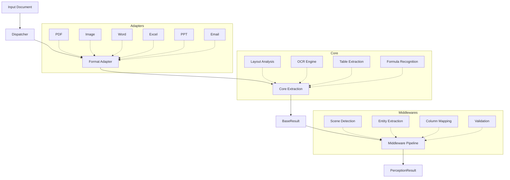

# Architecture

## System Overview



## Layer Architecture

| Layer | Module | Responsibility |
|-------|--------|---------------|
| **Dispatch** | `framework.dispatcher` | Route files to appropriate adapter |
| **Adapt** | `adapters.*` | Convert format → BaseResult |
| **Extract** | `core.extraction` | Low-level parsing (text, tables, layout) |
| **Enhance** | `middlewares.*` | Business logic pipeline |
| **Output** | `models.*` | Structured PerceptionResult |

## Data Flow

1. **Dispatcher** detects file type and selects adapter
2. **Adapter** converts raw document → immutable `BaseResult`
3. **Orchestrator** runs middleware pipeline on the result
4. **Middlewares** enhance: detect scene → extract entities → map columns → validate
5. **Builder** assembles final `PerceptionResult`

## Plugin System

Domain plugins extend DocMirror with business-specific logic:

```python
from docmirror.plugins import DomainPlugin

class InvoicePlugin(DomainPlugin):
    domain_name = "invoice"
    display_name = "Invoice"
    scene_keywords = ("invoice", "bill", "receipt")
    # ... implement build_domain_data()
```

See [Creating Plugins](../plugins/creating-plugins.md) for details.
