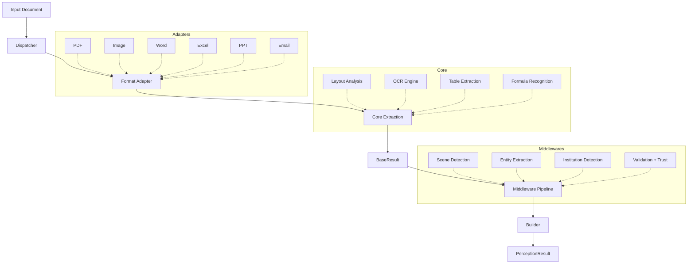

# Architecture

## System Overview



## Layer Architecture

| Layer | Module | Responsibility |
|-------|--------|---------------|
| **Dispatch** | `framework.dispatcher` | Route files to appropriate adapter, manage caching |
| **Adapt** | `adapters.*` | Convert format → `BaseResult` |
| **Extract** | `core.extraction` | Low-level parsing (text, tables, layout, OCR) |
| **Enhance** | `middlewares.*` | Business logic pipeline (detection, extraction, validation) |
| **Build** | `models.construction.builder` | Assemble final `PerceptionResult` |
| **Output** | `models.entities.perception_result` | Structured 4-layer output model |

## Data Flow

1. **Dispatcher** detects file type, checks Redis cache, and selects adapter
2. **Adapter** converts raw document → immutable `BaseResult`
3. **Orchestrator** runs middleware pipeline on the `EnhancedResult`
4. **Middlewares** execute in order: detect scene → extract entities → detect institution → validate
5. **Builder** assembles final `PerceptionResult` with persisted `scene` and entities
6. **Dispatcher** caches result to Redis (`model_dump_json` → `model_validate_json`)

## PerceptionResult Model

The output model has 4 layers:

| Layer | Field | Contents |
|-------|-------|----------|
| **Status** | `status`, `confidence`, `scene` | Parse result quality and document classification |
| **Content** | `content.text`, `content.blocks`, `content.entities` | Full text, structured blocks, key-value entities |
| **Trust** | `trust.validation_score`, `trust.image_quality` | Mirror fidelity scoring and image quality assessment |
| **Diagnostics** | `diagnostics.parser`, `diagnostics.elapsed_ms` | Performance and provenance metadata |

## Plugin System

Domain plugins extend DocMirror with business-specific logic:

```python
from docmirror.plugins import DomainPlugin

class InvoicePlugin(DomainPlugin):
    domain_name = "invoice"
    display_name = "Invoice"
    scene_keywords = ("invoice", "bill", "receipt")
    # ... implement build_domain_data()
```

See [Creating Plugins](../plugins/creating-plugins.md) for details.
