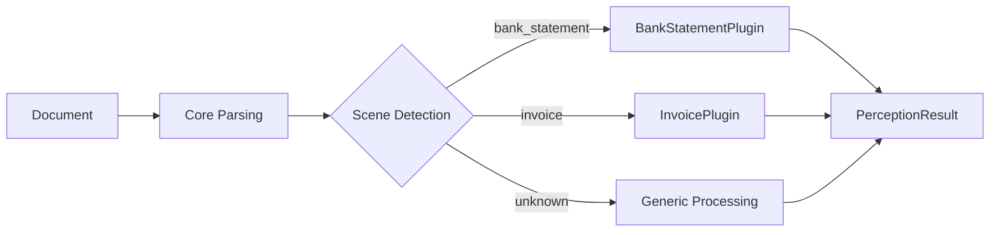

# Plugin System

DocMirror uses a plugin architecture to separate generic document parsing from domain-specific business logic.

## Built-in Plugins

| Domain | Plugin | Description |
|--------|--------|-------------|
| `bank_statement` | `BankStatementPlugin` | Bank statement processing with institution detection, entity extraction, and identity resolution |

## How Plugins Work



Each plugin provides:

1. **Scene keywords** — trigger automatic domain classification
2. **Identity fields** — domain-specific entity definitions (e.g., account holder, institution)
3. **Domain data builder** — structured output model construction

## Identity Resolution

When a plugin matches a detected scene, the `resolve_identity()` function uses the plugin's identity field definitions to map extracted entities into standardized properties:

```json
{
  "identity": {
    "document_type": "bank_statement",
    "properties": {
      "institution": "Example National Bank",
      "account_holder": "Acme Technology Co., Ltd.",
      "account_number": "6200000000001234567",
      "query_period": "2025/01/01 - 2025/12/31",
      "currency": "CNY"
    }
  }
}
```
