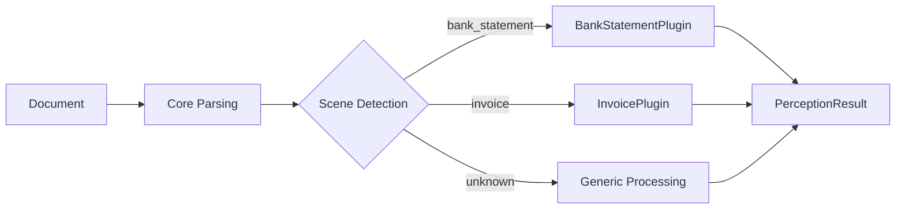

# Plugin System

DocMirror uses a plugin architecture to separate generic document parsing from domain-specific business logic.

## Built-in Plugins

| Domain | Plugin | Description |
|--------|--------|-------------|
| `bank_statement` | `BankStatementPlugin` | Bank statement processing with institution detection, column mapping, and transaction extraction |

## How Plugins Work

Each plugin provides:

1. **Scene keywords** — trigger automatic domain classification
2. **Identity fields** — domain-specific entity definitions
3. **Standard columns** — column name standardization rules
4. **Domain data builder** — structured output model construction
